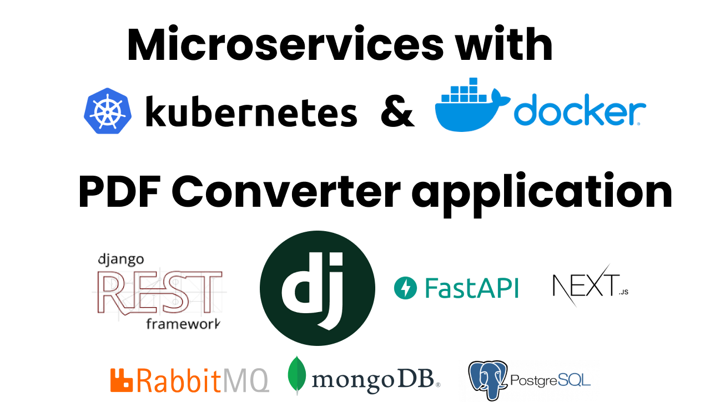

# Microservices with Docker, Kubernetes, RabitMQ, PDF Converter

This course material is tailored for my Kubernettes and Docker
. It covers the fundamentals of Kubernetes and Docker, along with a practical guide to building a PDF converter microservice. This tutorial is designed to help you understand containerization, orchestration, and microservice architecture through hands-on examples.

## About Me:

My name is Daniel Okot. I am a software engineer. For about 3 years, I have been building software and i share my experience at my [Youtube channel](https://youtube.com/@okotdaniels) where I educate people about programming mainly using the Python language. I have worked on freelance, and fulltime roles. I have a passion for educating others and sharing knowledge. When am not coding am sleeping.
 

If you enjoy this content, please consider subscribing to my [YouTube channel](https://youtube.com/@okotdaniels) for more tutorials and updates. Your support helps me create more valuable resources for the community. Don't forget to like, share, and comment to help others discover this content!

## Follow me on the following platforms
- [Twitter](https://twitter.com/okotdaniels)
- [Github](https://github.com/okotdaniel)
- [Youtube](https://youtube.com/@okotdaniels)